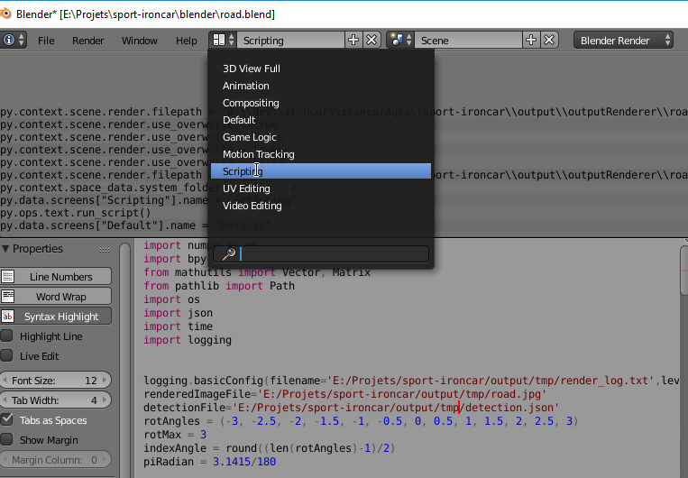
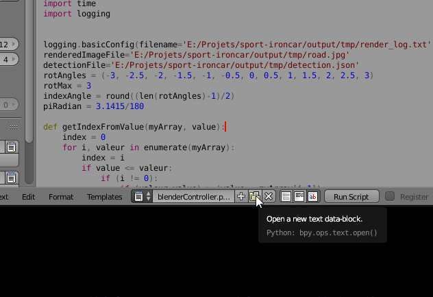
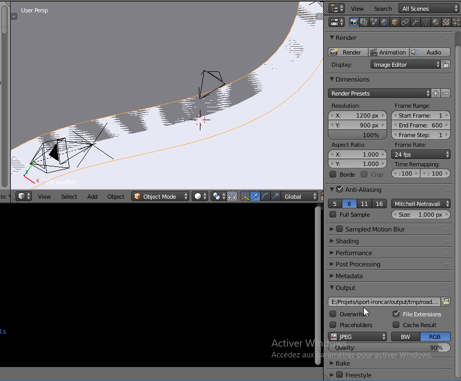
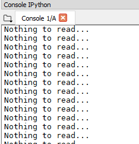

# Ironcar
Mini-car, big challenge!

## Le simulateur

### Pré-requis
- Installer Blender 3D v.2.79b
- Installer Anaconda (et donc Spyder)

### Configuration
#### Blender
1. Ouvrir ./blender/road.blend avec Blender 3D
2. Passer en mode Script

3. Ouvrir le fichier ./simulateur/blenderController.py

4. Changer les chemins vers les fichiers (les répertoires doivent exister)
5. Dans le panneau latéral droit, changer le chemin vers le screenshot à exporter

#### Anaconda
1. Ouvrir une console CMD dans le répertoire [Anaconda]/Scripts/
2. Installer opencv avec la commande *conda.exe install -c conda-forge opencv*
3. Installer moviepy avec la commande *conda install -c conda-forge moviepy*

#### Spyder
1. Ouvrir Spyder
2. Ouvrir le fichier ./simulateur/imageAnalyser.py
3. Changer les chemins vers les fichiers (ils doivent correspondre à ceux saisis dans Blender 3D)
4. Lancer le script

&rarr; La console doit afficher "Nothing to read..."

### Utilisation
1. Ouvrir ./blender/road.blend avec Blender 3D
2. Ouvrir l'éditeur de scripts (Window > Scripting) et charger le fichier ./simulateur/blenderController.py
3. Ouvrir ./simulateur/imageAnalyser.py avec Spyder
4. Lancer le code python dans Spyder
5. Lancer le code python dans Blender

&rarr; Il existe une variable *NB_ITERATIONS* dans ./simulateur/imageAnalyser.py qui définit quand la simulation s'arrête (1 itération = 1 image, à raison de 24 images / secondes).

&rarr; A la fin de la simulation, le répertoire défini par la variable *imageDebugDir* du code de ./simulateur/imageAnalyser.py contient toutes les images et le répertoire *videoOuputFile* contient la vidéo assemblée à partir de toutes ces images.

&rarr; Blender 3D ne s'arrêtant pas tout seul, une solution est de mettre le texte `stop` dans le fichier pointé par la variable *jsonOutputFile*
